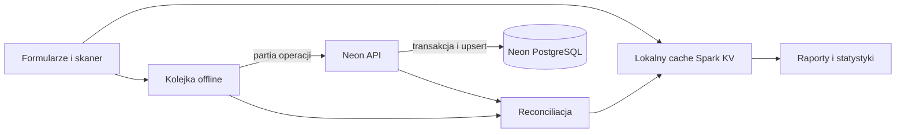

# Audyt spójności danych i funkcji

Data audytu: 2026-07-30

## Jak działa przepływ danych

1. Po uruchomieniu aplikacja pobiera produkty z Neon.
2. Oczekujące operacje offline są nakładane na snapshot serwera, więc lokalna zmiana nie znika podczas startu.
3. Dodanie, import, edycja, dostawa albo zmiana statusu aktualizują lokalny cache i dodają operację do kolejki.
4. Kolejka scala wiele zmian tego samego produktu. `create` pozostaje `create`, jeśli produkt został edytowany przed pierwszą synchronizacją.
5. API zapisuje partię w jednej transakcji. `create` i `update` używają upsertu, a starszy `updatedAt` nie nadpisuje nowszego rekordu.
6. Po sukcesie z kolejki usuwane są tylko operacje należące do wysłanej partii.
7. Raporty są obliczane z lokalnego, zreconciliowanego stanu.

## Niezmienniki produktu

Dla każdego produktu obowiązuje:

- `statuses.length === quantity`
- `statusChangedAt.length === quantity`
- `discounts.length === quantity`
- nieznany lub brakujący status jest normalizowany do `available`
- rabat jest liczbą z zakresu 0-100
- zmiana statusu sztuki aktualizuje wyłącznie odpowiadający jej indeks daty
- VAT 0% pozostaje wartością 0, a nie fallbackiem do 23%
- `priceGross`, `priceNet`, `vatRate` i `salePrice` są utrwalane w Neon

## Raporty

### Sprzedaż

Raport używa statusu i daty konkretnej sztuki. Rabat również jest przypisany do indeksu sztuki. Zmiana czwartej sztuki nie zmienia dat pierwszych trzech.

### Zużycie

Raport dzienny, miesięczny i roczny obejmuje sztuki, których aktualny status to `used`. Datą raportową jest `statusChangedAt[index]`.

### Zakupy

Aktualny raport zakupów opiera się na `purchaseDate`, bieżącej cenie brutto produktu i całkowitym `quantity`.

## Naprawione niespójności

- datowanie wszystkich sprzedaży wspólnym `product.updatedAt`
- nadpisywanie statusu początkowego wartością `available`
- brak synchronizacji produktów importowanych z CSV
- lokalne, nietrwałe działanie „Usuń wszystkie dane”
- utrata VAT oraz cen netto/brutto po odświeżeniu danych z Neon
- rozjazd długości `quantity`, `statuses`, `statusChangedAt` i `discounts`
- utrata operacji dopisanych podczas trwającej synchronizacji
- zamiana `create` na nieskuteczne `update` przed pierwszą synchronizacją
- nadpisywanie nowszego rekordu przez starszą kolejkę offline
- mutowanie tablicy produktów podczas sortowania
- różne sposoby odczytu legacy `price`
- niespójny eksport CSV
- martwe, alternatywne implementacje edytora i raportu
- brakująca konfiguracja ESLint 9

## Pozostałe ograniczenia modelu

1. System przechowuje aktualny status i ostatnią datę zmiany każdej sztuki, a nie pełny dziennik zdarzeń. Po cofnięciu sprzedaży wpis znika z raportu zgodnie z aktualnym stanem.
2. Dostawy nie mają osobnych dat i cen zakupu dla każdej partii. Po kolejnej dostawie raport zakupów nadal przypisuje całe `quantity` do głównego `purchaseDate`.
3. Cena sprzedaży nie jest zamrażana w chwili sprzedaży. Zmiana globalnej ceny produktu może zmienić wartość historycznych sprzedaży; rabat procentowy pozostaje przypisany do sztuki.
4. Dla rekordów utworzonych przed dodaniem `statusChangedAt` nie da się odtworzyć dokładnej historii. Fallbackiem jest dawne `updatedAt` produktu.
5. Konflikty wielu urządzeń są rozstrzygane przez ISO `updatedAt`, więc poprawność zależy od rozsądnie ustawionych zegarów urządzeń.
6. Produkcyjny bundle przekracza 500 kB i może w przyszłości wymagać podziału przez lazy loading.

Pełna historia dostaw i niezmienne raporty finansowe wymagają osobnej tabeli zdarzeń lub tabeli jednostek produktu z datą oraz ceną zakupu/sprzedaży.

## Krytyczne ryzyko bezpieczeństwa

Logowanie chroni obecnie interfejs, ale endpointy `products`, `brands`, `gammas` i `budget` nie weryfikują tokenu JWT. Dodatkowo `login` i `check_session` używają stałego fallbacku `change_this_secret`, gdy brakuje `JWT_SECRET`.

Przed publicznym wdrożeniem należy:

1. ustawić silny `JWT_SECRET` w środowisku Preview i Production,
2. usunąć fallback sekretu z kodu,
3. dodać wspólną walidację sesji do wszystkich endpointów odczytu i zapisu danych,
4. przetestować odpowiedzi 401 dla żądań bez ważnego cookie.

## Wdrożenie

Przed wdrożeniem tej wersji na istniejącą bazę należy ponownie wykonać `sql/schema_neon.sql`. Migracja dodaje brakujące kolumny i uzupełnia ceny starszych rekordów.

## Weryfikacja

- `npm run lint`
- `npm exec tsc -- --noEmit`
- `npm run build`
- test `create + update => create` kolejki offline
- test reconciliacji snapshotu Neon z operacjami create/update/delete
- test Playwright importu CSV, VAT 0%, statusów, synchronizacji i trwałego czyszczenia
- test Playwright raportów sprzedaży i zużycia dla dnia, miesiąca i roku
